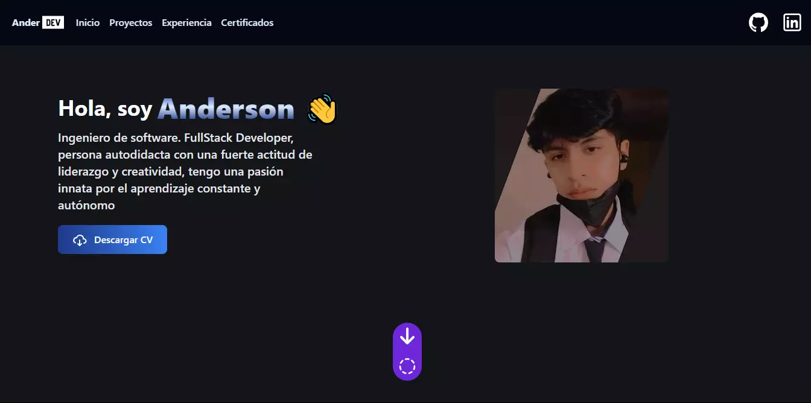
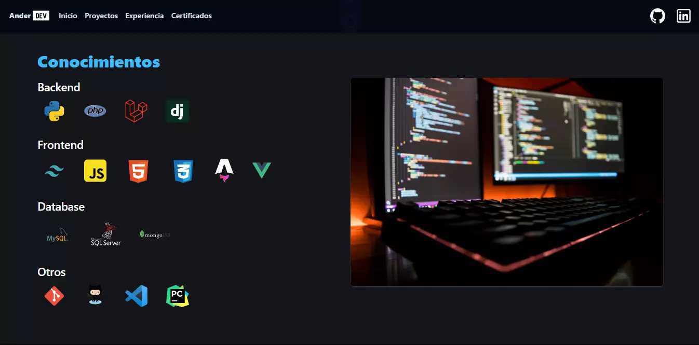

<h1 align="center" id="title">Portafolio web</h1>

Portafolio web with Astro and Tailwindcss

<h2>🚀 Deploy 🚀</h2>

[https://portafolio-ander-dev.vercel.app/](https://portafolio-ander-dev.vercel.app/)

<h2>Project Screenshots:</h2>

 

  
  
<h2>💻 Technologies </h2>

Technologies used in the project:

*   Astro
*   Tailwind
*   JavaScript

<h2>🛡️ License:</h2>

This project is licensed under the @AnderDev

# Version 1.0